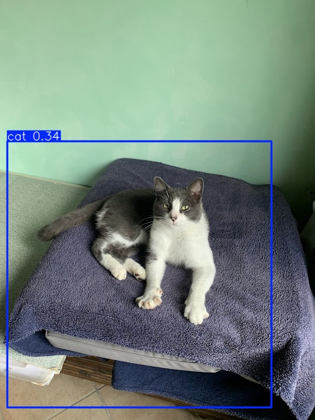
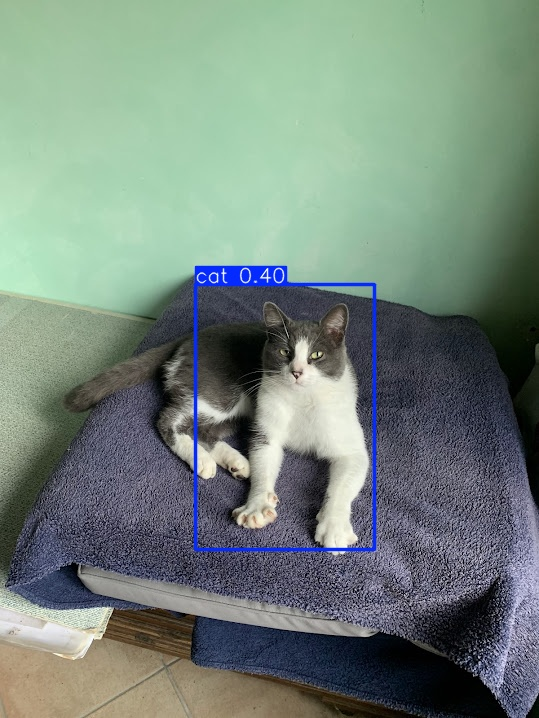
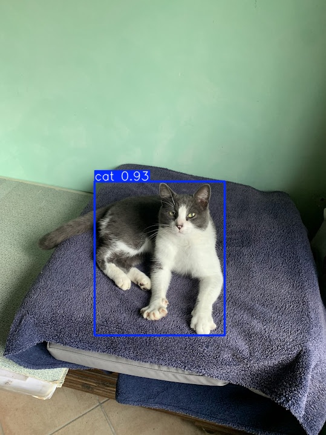

# 🐱 CatDetector

**CatDetector** is an object detection project based on **YOLOv11**, designed to detect **cats** in images, videos, and real-time webcam streams.

## 📌 Overview

The model identifies cats by drawing bounding boxes around them, along with confidence scores. It was trained on a **custom dataset** consisting of:

- **570 training images**
- **124 validation images**

The dataset was partially annotated manually, using CVAT.

## 🧠 Training Details

Three separate training sessions were performed on the same dataset:

1. **YOLOv11n from scratch (local):**
   - 80 epochs  
   - Configuration: `yolo11n.yaml`

2. **YOLOv11n from scratch (Google Colab):**
   - 150 epochs  
   - Configuration: `yolo11n.yaml`

3. **YOLOv11n with pretrained weights (Google Colab):**
   - 150 epochs  
   - Starting from `yolo11n.pt`

## 🛠️ Dependencies

Make sure the following packages are installed:

```bash
pip install ultralytics
```

## 📂 Project Structure

```
CatDetector/
├── Dataset/
│   ├── images/
│   └── labels/
├── colab_scripts/
│   ├── CatDetector.ipynb
│   └── config.yaml
├── images/
├── videos/
├── runs/
├── runs_colab_fromscratch/
├── runs_colab_pretrained/
├── predictimage.py
├── predictvideo.py
├── webcamscript.py
├── main.py
├── config.yaml
├── README.md

```
### 📂 colab_scripts

The `colab_scripts` folder contains two files used for training the model on Google Colab with integration to Google Drive:

- `CatDetector.ipynb`: a Jupyter notebook with the full training code for Colab.

- `config.yaml`: configuration file used during training.

These scripts enable training using Google’s cloud resources, allowing you to leverage more powerful hardware without running the training locally.


## 🖼️ Example Output


*Figure 1: Example of cat detection using YOLOv11n from scratch (local Model).*


*Figure 1: Example of cat detection using YOLOv11n from scratch (Colab Model).*


*Figure 1: Example of cat detection using YOLOv11n pretrained (Colab Model).*