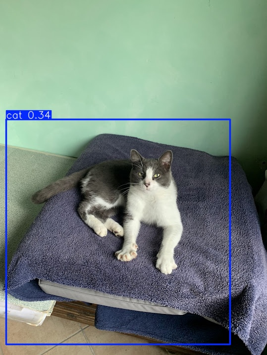
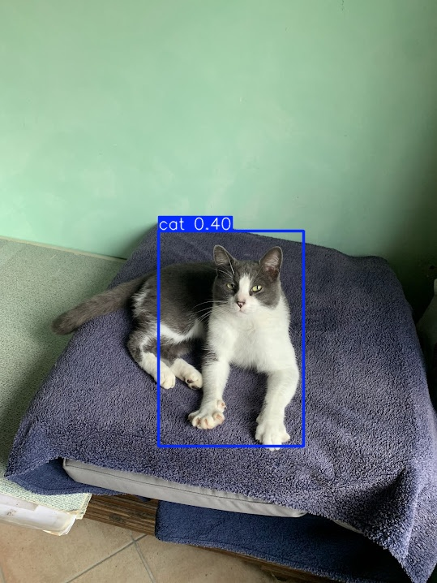
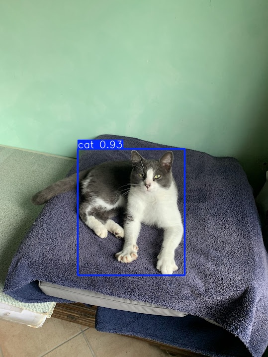

<h1 align="center">CatDetector</h1> 

 
   
   
   
   

 

 
  <strong>CatDetector</strong> is an object detection system based on <strong>YOLOv11</strong>, designed to detect <strong>cats</strong> in images, videos, and real-time webcam streams. 

 

<h2>Overview</h2> 

 
  The model identifies cats by drawing bounding boxes with confidence scores. It was trained on a <strong>custom dataset</strong> consisting of: 

 
<ul> 
  <li><strong>570</strong> training images</li> 
  <li><strong>124</strong> validation images</li>
</ul> 

  The dataset was partially annotated manually using CVAT.

 

<h2>Training Details</h2> 

Three separate training sessions were performed on the same dataset:

<ol> 
  <li><strong>YOLOv11n from scratch (local):</strong>  80 epochs — Configuration: <code>yolo11n.yaml</code> </li> 
  <li><strong>YOLOv11n from scratch (Google Colab):</strong>  150 epochs — Configuration: <code>yolo11n.yaml</code> </li> 
  <li><strong>YOLOv11n with pretrained weights (Google Colab):</strong>  150 epochs — Starting from <code>yolo11n.pt</code> </li>
</ol> 

<h2>Dependencies</h2> 

Install the required packages:
 <pre><code>pip install ultralytics </code></pre>

<h2>Colab Scripts</h2> 

 The <code>colab_scripts</code> folder contains the files used for training the model on Google Colab with Google Drive integration: 
 
<ul> 
  <li><code>CatDetector.ipynb</code>: Jupyter notebook with the full training workflow.</li> 
  <li><code>config.yaml</code>: Configuration file used during training.</li> 
</ul> 

 These scripts enable training using Google’s cloud resources, allowing you to leverage more powerful hardware compared to local training. 
 

<h2>Example Output</h2> 

<strong>Figure 1:</strong> Cat detection using YOLOv11n from scratch (Local Model)
 

  

<strong>Figure 2:</strong> Cat detection using YOLOv11n from scratch (Colab Model)

  

<strong>Figure 3:</strong> Cat detection using YOLOv11n pretrained (Colab Model)
 

  

